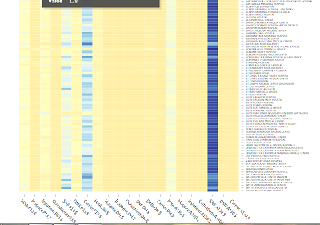

Medicare Spending Per Episode
========================================================
author: Srinivasan Sastry
date: Fri May 06 00:24:52 2016
autosize: true

Medicare Spending App Context
========================================================
font-family: sans-serif

<small>

This shiny app is designed to compare average spending levels during hospitals' Medicare Spending per Beneficiary (MSPB) episodes for year 2014. The data presented on the Hospital Compare webpages provide price-standardized, non-risk-adjusted values. 
The data is measured for calender year 2014  and provides the details on 
  - Avg Spending Per Episode (Hospital)
  - Avg Spending Per Episode (State)
  - Avg Spending Per Episode (Nation)
  
measured across hospitals in all states 7 "Claim Types" and  3 "Periods" by provider. Data might be consolidated for states that donot have enough hospitals in them.

</small>

Medicare Spending App
===================
type: pinky 
<small> Summary Map</small>

<small> <small>Summary - Compares National Average to State Average for the claim Type and Period </small></small>

<small> Medicare Data(Partial Pic)</small>

***
<small> Heat Map (Partial Pic)</small>

<small> <small>Heat Map  - Spending in various hospitals for the state for  Claim Types and Period.</small></small>

<small> <small>Table - Analyze and search raw data for the state,Claim Type and Period.</small></small>

App Details
==========
- Summary Map - Based on "Claim Type" and "Period" chosen, State level, Average spending $is compared to National Average Spending $.  
- Medicare Data - Based on the "Claim Type","Period" and "State" chosen, Medicare Raw data is dispalyed for analysis
- Heat Map - Comparison of Avg spending against various claim types and Periods in various hospitals of a state could be made. The plot is interactive, the columns can be sorted and spending can be analyzed. Heat map nicely arranges the spending into color bands so it is easy to spot big hitters.
- State drop down is populated dynamically. 

Conclusions
=====
<small><small>
Observations

1. Cost of care seems to be high for Claim Type = "Skilled Nursing Period" and Period = "1 through 30 days After Discharge from Index Hospital Admission"  in most states
2. There seems to be lack of data  for some categories 

Improvements

1. Check box could be added to get userinputs for kind of analysis to perform, so the controls can be dynamically adjusted 
2. Height of the heat map adjusted based on the rows of the data set selected 

***

References:

["Spending Per Hospital Patient"](https://www.medicare.gov/hospitalcompare/Data/spending-per-hospital-patient.html)
***
["Fact-Sheet-MSPB-Spending-Breakdowns-by-Claim-Type-Dec-2014.pdf"](https://www.cms.gov/Medicare/Quality-Initiatives-Patient-Assessment-Instruments/hospital-value-based-purchasing/Downloads/Fact-Sheet-MSPB-Spending-Breakdowns-by-Claim-Type-Dec-2014.pdf)
***
["Top Five CSS Customizations for R Presentations by Andy Lyons"](http://rstudio-pubs-static.s3.amazonaws.com/27777_55697c3a476640caa0ad2099fe914ae5.html#/)
</small></small>
